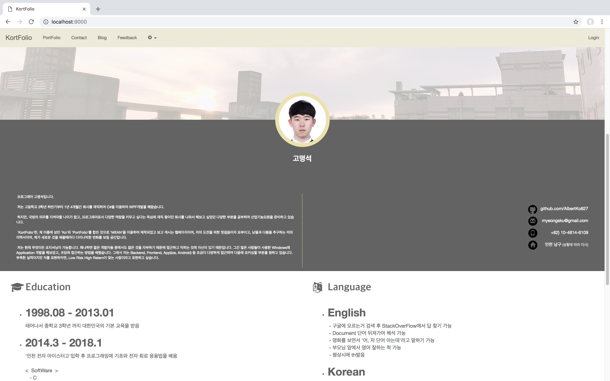
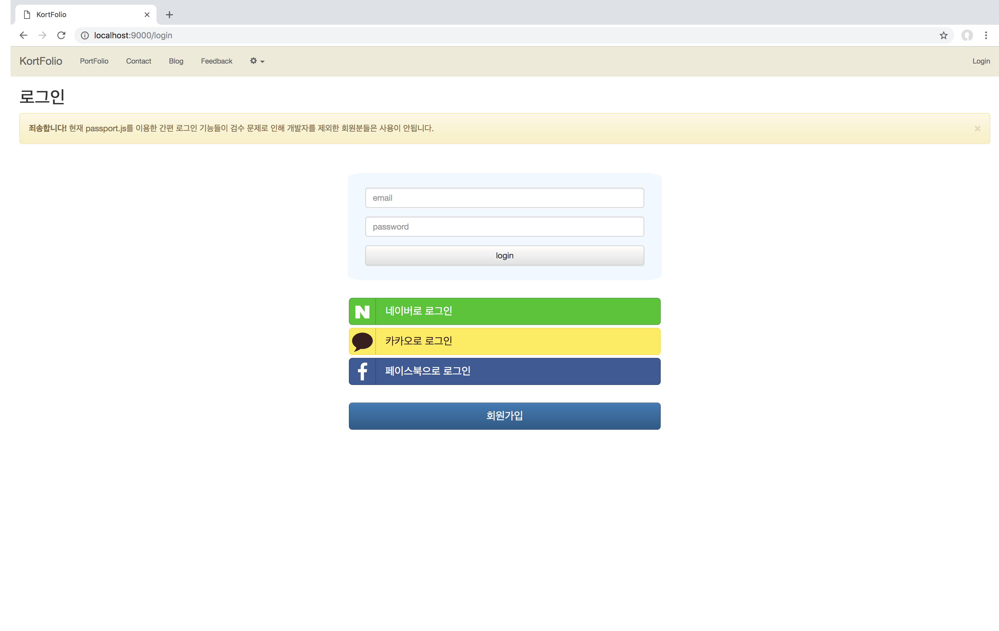
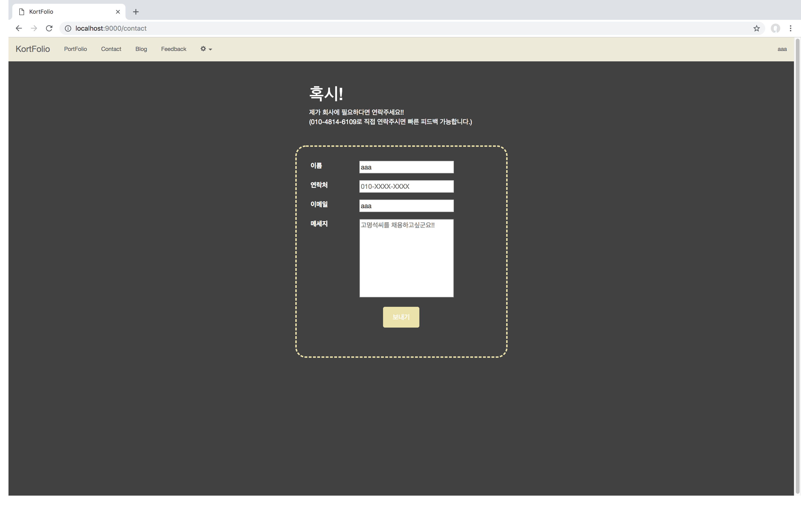
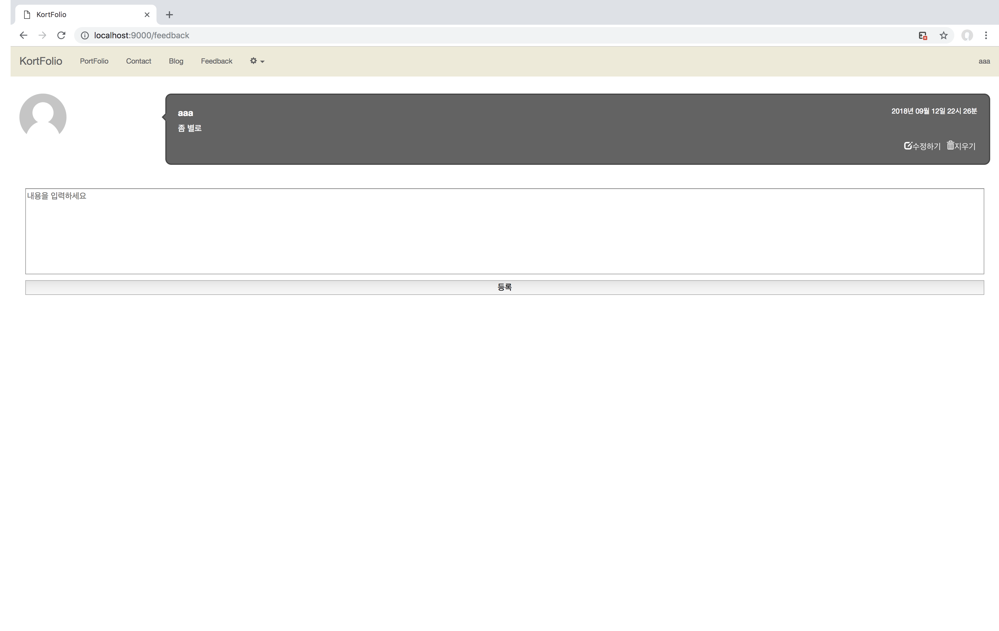

KortFolio
===============
# KortFolio란
* * *
KortFolio란 제 포트폴리오 대체를 위해 MEAN Stack으로 만들어 제 성인 Ko와 portfolio를 합쳐 작명한 것입니다.

## 메인 페이지
* * *

메인부분으로 저를 소개한 페이지입니다.

## 로그인 페이지
* * *

로그인 페이지입니다.

로그인은 passport.js를 이용하여 aouth 인증 방식을 사용했습니다.

## 포트폴리오 페이지
* * *

제가 그동안 해온 프로젝트 및 자료를 볼 수 있는 페이지입니다.

## 컨택트 페이지
* * *

혹시 kortfolio를 보고 저에게 문의할 것이 있는 분들을 위해 넣었습니다.
nodemailer.js 를 이용하여 저에게 메일을 보낼 수 있도록 만들었습니다.

## 피드백 페이지
* * *

kortfolio에 대해서 피드백을 줄 수 있도록 만든 페이지입니다.

## 개인적인 평가
* * *
웹에 대해서 아무것도 모르던 때에 공부를 하기 위해 처음 만들었던 남다른 프로젝트입니다.
하지만, 막상 시간이 지나 좀더 웹에 대해서, SPA에 대해서 여러 가지를 공부하고 여러 사람을 보고 배우며
참 부족한 점이 많은 페이지임이 와닿습니다.

C# 개발자로, 사수가 없다싶이하여 부딛히면서 개발을 해오던 습관이 묻어있는게 눈에 너무 보입니다.
말그대로, 동작을 위해 여기저기서 자료를 보고 응용만 했을 뿐 베이스가 안 되있던 것 같습니다.

KortFolio를 보면 웹을 처음 시작했던 때가 생각도 나고 정말 부여주기 부끄러운 부분도 많다보니
스스로의 발전을 위한 도핑제 같은 역할을 해주는 다른의미로 저에게 중요했던 하나의 프로젝트입니다.
